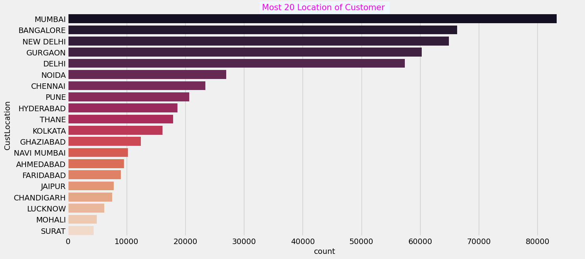

Bank Customer Segmentation
--------------------------

.. automodule:: scriptNotebook

.. raw:: html

   <h2 style="font-weight:bold; font-family:sans-serif">

Goal of creating this Notebook

.. raw:: html

   </h2>

1. Perform Clustering / Segmentation on the dataset and identify popular
   customer groups along with their definitions/rules
2. Perform Location-wise analysis to identify regional trends in India
3. Perform transaction-related analysis to identify interesting trends
   that can be used by a bank to improve / optimi their user experiences
4. Customer Recency, Frequency, Monetary analysis
5. Network analysis or Graph analysis of customer data.

**Table of contents of this notebook:**

**1.** Importing Necessary Libraries **2.** Data Collection **3.** Data
Cleaning **4.** Exploratory Data Analysis

.. raw:: html

   <h2  style="text-align: center; padding: 20px; font-weight:bold">

1. Importing Libraries

   .. raw:: html

      </h2>

.. code:: ipython3

    import re
    import numpy as np 
    import pandas as pd 
    import matplotlib.pyplot as plt
    %matplotlib inline
    plt.style.use("fivethirtyeight")
    import seaborn as sns

.. raw:: html

   <h2  style="text-align: center; padding: 20px; font-weight:bold">

2. Data Collection

   .. raw:: html

      </h2>

We import our relative path Dataset and in addition to that, we rename
the TransactionAmount (INR) column in TransactionAmount, this in order
to avoid that in the future the special characters of the original name
give us problems.

.. autofunction:: scriptNotebook.import_data
.. code:: ipython3

    def import_data():
        """
        This function get the DataSet and rename a column.
        :param:
        :return: Dataframe
        """
        dfGet = pd.read_csv("../data/bank_transactions.csv")
        initialRows = len(dfGet)
        dfGet = dfGet.rename(columns={'TransactionAmount (INR)':'TransactionAmount'})
        return dfGet
    
    df = import_data()
    df.head()
    

.. raw:: html

    

    
    <table border="1" class="dataframe">
      <thead>
        <tr style="text-align: right;">
          <th></th>
          <th>TransactionID</th>
          <th>CustomerID</th>
          <th>CustomerDOB</th>
          <th>CustGender</th>
          <th>CustLocation</th>
          <th>CustAccountBalance</th>
          <th>TransactionDate</th>
          <th>TransactionTime</th>
          <th>TransactionAmount</th>
        </tr>
      </thead>
      <tbody>
        <tr>
          <th>0</th>
          <td>T1</td>
          <td>C5841053</td>
          <td>10/1/94</td>
          <td>F</td>
          <td>JAMSHEDPUR</td>
          <td>17819.05</td>
          <td>2/8/16</td>
          <td>143207</td>
          <td>25.0</td>
        </tr>
        <tr>
          <th>1</th>
          <td>T2</td>
          <td>C2142763</td>
          <td>4/4/57</td>
          <td>M</td>
          <td>JHAJJAR</td>
          <td>2270.69</td>
          <td>2/8/16</td>
          <td>141858</td>
          <td>27999.0</td>
        </tr>
        <tr>
          <th>2</th>
          <td>T3</td>
          <td>C4417068</td>
          <td>26/11/96</td>
          <td>F</td>
          <td>MUMBAI</td>
          <td>17874.44</td>
          <td>2/8/16</td>
          <td>142712</td>
          <td>459.0</td>
        </tr>
        <tr>
          <th>3</th>
          <td>T4</td>
          <td>C5342380</td>
          <td>14/9/73</td>
          <td>F</td>
          <td>MUMBAI</td>
          <td>866503.21</td>
          <td>2/8/16</td>
          <td>142714</td>
          <td>2060.0</td>
        </tr>
        <tr>
          <th>4</th>
          <td>T5</td>
          <td>C9031234</td>
          <td>24/3/88</td>
          <td>F</td>
          <td>NAVI MUMBAI</td>
          <td>6714.43</td>
          <td>2/8/16</td>
          <td>181156</td>
          <td>1762.5</td>
        </tr>
      </tbody>
    </table>
    

We obtain the initial information of the Dataset, the number of records,
number of variables, non-null objects and data type.

.. code:: ipython3

    display(df.info())

.. parsed-literal::

    <class 'pandas.core.frame.DataFrame'>
    RangeIndex: 1048567 entries, 0 to 1048566
    Data columns (total 9 columns):
     #   Column              Non-Null Count    Dtype  
    ---  ------              --------------    -----  
     0   TransactionID       1048567 non-null  object 
     1   CustomerID          1048567 non-null  object 
     2   CustomerDOB         1045170 non-null  object 
     3   CustGender          1047467 non-null  object 
     4   CustLocation        1048416 non-null  object 
     5   CustAccountBalance  1046198 non-null  float64
     6   TransactionDate     1048567 non-null  object 
     7   TransactionTime     1048567 non-null  int64  
     8   TransactionAmount   1048567 non-null  float64
    dtypes: float64(2), int64(1), object(6)
    memory usage: 72.0+ MB
    

.. parsed-literal::

    None

.. raw:: html

   <h2  style="text-align: center; padding: 20px; font-weight:bold">

3. Data Cleaning

   .. raw:: html

      </h2>

The amount of null data and unique is calculated

.. code:: ipython3

    def check(df):
        l=[]
        columns=df.columns
        for col in columns:
            dtypes=df[col].dtypes
            nunique=df[col].nunique()
            sum_null=df[col].isnull().sum()
            l.append([col,dtypes,nunique,sum_null])
        df_check=pd.DataFrame(l)
        df_check.columns=['Column','Types','Unique','Nulls']
        return df_check 
    check(df)
    

.. raw:: html

    

    
    <table border="1" class="dataframe">
      <thead>
        <tr style="text-align: right;">
          <th></th>
          <th>Column</th>
          <th>Types</th>
          <th>Unique</th>
          <th>Nulls</th>
        </tr>
      </thead>
      <tbody>
        <tr>
          <th>0</th>
          <td>TransactionID</td>
          <td>object</td>
          <td>1048567</td>
          <td>0</td>
        </tr>
        <tr>
          <th>1</th>
          <td>CustomerID</td>
          <td>object</td>
          <td>884265</td>
          <td>0</td>
        </tr>
        <tr>
          <th>2</th>
          <td>CustomerDOB</td>
          <td>object</td>
          <td>17254</td>
          <td>3397</td>
        </tr>
        <tr>
          <th>3</th>
          <td>CustGender</td>
          <td>object</td>
          <td>3</td>
          <td>1100</td>
        </tr>
        <tr>
          <th>4</th>
          <td>CustLocation</td>
          <td>object</td>
          <td>9355</td>
          <td>151</td>
        </tr>
        <tr>
          <th>5</th>
          <td>CustAccountBalance</td>
          <td>float64</td>
          <td>161328</td>
          <td>2369</td>
        </tr>
        <tr>
          <th>6</th>
          <td>TransactionDate</td>
          <td>object</td>
          <td>55</td>
          <td>0</td>
        </tr>
        <tr>
          <th>7</th>
          <td>TransactionTime</td>
          <td>int64</td>
          <td>81918</td>
          <td>0</td>
        </tr>
        <tr>
          <th>8</th>
          <td>TransactionAmount</td>
          <td>float64</td>
          <td>93024</td>
          <td>0</td>
        </tr>
      </tbody>
    </table>
    

Eliminamos los valores nulos

.. code:: ipython3

    shapeInitial = df.shape[0]
    df.dropna(inplace=True)
    shapeFinal = shapeInitial-df.shape[0]
    print("Amount to remove " + str(shapeFinal))

.. parsed-literal::

    Amount to remove 6953
    

The amount of null values to eliminate is equal to 6953 data, we
eliminate these values because they do not represent more than 0.7% of
the total data. We check if there are repeated elements in our DataSet

.. code:: ipython3

    df.duplicated().sum()

.. parsed-literal::

    0

The CustomerDOB column is analyzed because it may contain atypical data.
We analyze the number of records for each client’s date of birth.

.. code:: ipython3

    # Getting distinct values from CustomerDOB variable
    df['CustomerDOB'].value_counts()

.. parsed-literal::

    1/1/1800    56292
    1/1/89        809
    1/1/90        784
    6/8/91        698
    1/1/91        665
                ...  
    2/12/51         1
    20/3/52         1
    26/9/47         1
    4/10/41         1
    24/10/44        1
    Name: CustomerDOB, Length: 17233, dtype: int64

Dates 1/1/1800 are deleted because it is not possible to define whether
they are children, adults or persons without date of birth. This is an
important variable for the business, for this reason we cannot make
assumptions that bias the project, for this reason, it is better to
eliminate these outliers or erroneously measured data.

.. code:: ipython3

    # Removing CustomerDOB == '1/1/1800'
    df = df.loc[~(df['CustomerDOB'] == '1/1/1800')]
    # Cheking distinct values from dataframe
    df['CustomerDOB'].value_counts()

.. parsed-literal::

    1/1/89      809
    1/1/90      784
    6/8/91      698
    1/1/91      665
    1/1/92      631
               ... 
    23/2/05       1
    28/11/42      1
    23/9/49       1
    14/3/40       1
    24/10/44      1
    Name: CustomerDOB, Length: 17232, dtype: int64

We print the minimum and maximum date of the CustomerDOB column in order
to see in which range the values in this column oscillate.

.. code:: ipython3

    # Range of CustomerDOB object type as string
    print("min: " + df['CustomerDOB'].min() + " max: " + df['CustomerDOB'].max())

.. parsed-literal::

    min: 1/1/00 max: 9/9/97
    

It can be seen that the person with the oldest birth date has a date of
January 1, 1900 and the youngest person has a date of September 9, 1997.

Convert type of columns TransactionDate, CustomerDOB from string to
datetime, this convertation will be in the format of dayfirst, so the
date will be DD/MM/YY

.. code:: ipython3

    # Using pandas convert to datetime tool for CustomerDOB variable with specific format
    df['CustomerDOB'] = pd.to_datetime(df['CustomerDOB'], dayfirst=True)

Now we will check if the conversion was as expected and in the required
format.

.. code:: ipython3

    # Checking converting problem of to_datetime pandas function
    print(df['CustomerDOB'].min(), df['CustomerDOB'].max())

.. parsed-literal::

    1973-01-01 00:00:00 2072-12-31 00:00:00
    

We can see that the most “recent” date is December 31, 2072, but it is
illogical because this is a future date, so we subtract 100 from all
values greater than 1999 to get the real value. (This is a problem
Pandas has when converting a date).

.. code:: ipython3

    # Fixing the problem base on analysis above
    df.loc[df['CustomerDOB'].dt.year > 1999, 'CustomerDOB'] -= pd.DateOffset(years=100)
    print(df['CustomerDOB'].min(), df['CustomerDOB'].max())

.. parsed-literal::

    1900-01-01 00:00:00 1999-12-28 00:00:00
    

In the same way that we converted the CustomerDOB column, we convert the
TransactionDate column with the same expected format as the first day.

.. code:: ipython3

    # Using pandas convert to datetime tool for TransactionDate variable
    df['TransactionDate'] = pd.to_datetime(df['TransactionDate'], dayfirst=True)
    # Checking range of TransactionDate variable
    print(df['TransactionDate'].min(), df['TransactionDate'].max())

.. parsed-literal::

    2016-08-01 00:00:00 2016-10-21 00:00:00
    

All the trnasactions took place in a roughly two month period from
August to October, this could account for the low transaction frequency

Once all the unnecessary data for the study has been eliminated, we can
see the following summary, which shows us how much data we lost and what
is the percentage of loss obtained

.. code:: ipython3

    print(" Number of initial rows: ", initialRows, "\n",
    "Number of rows after: ", df.shape[0], "\n",
    "Number of rows deleted: ", initialRows - df.shape[0], "\n",
    "Percentage of rows deleted: ", (initialRows - df.shape[0]) / initialRows * 100, "%")

.. parsed-literal::

     Number of initial rows:  1048567 
     Number of rows after:  985322 
     Number of rows deleted:  63245 
     Percentage of rows deleted:  6.03156498344884 %
    

We can see that we lost 6.03% of the data, although what is expected by
theory is to lose less than 5% in this case we must ignore this metric
because there are null values and measurement failure errors that force
us to eliminate them, because we cannot speculate about them.

.. raw:: html

   <h2  style="text-align: center;padding: 20px;font-weight:bold">

4. Exploratory Data Analysis

   .. raw:: html

      </h2>

Determine minority group of people aged over 100 years

    
.. code:: ipython3

    def filterDOB(dataframe):  
      return dataframe["CustomerDOB"].apply(lambda x: x if x.year < 1917 else 0)

    df_filtered = filterDOB(df)

    # Amortizing and removing values ​​greater than 1917 represented as 0
    counts = df_filtered.value_counts().drop(0)
    print(counts)
    # Amount of customer in this age range
    print(len(counts))
    # Plot the amortized
    counts.plot()
    plt.show()
    del df_filtered

.. parsed-literal::

    1900-04-11    18
    1902-03-31    18
    1903-02-19    18
    1901-09-22    18
    1907-01-02    16
                  ..
    1913-10-22     1
    1913-02-04     1
    1905-02-23     1
    1903-03-07     1
    1915-11-18     1
    Name: CustomerDOB, Length: 254, dtype: int64
    254
    

.. image:: Customer_Segmentation_files/Customer_Segmentation_37_1.png

.. raw:: html

   <h3>

Calculate customer age :

.. raw:: html

   </h3>

CustomerDOB: is the birth date of the customer TransactionDate: is the
date of transaction that customer is done The age calculation is done by
subtracting the TransactionDate from the CustomerDOB.

.. code:: ipython3

    # Getting the customer age at transaction moment and adding a new column in our dataframe
    df['CustomerAge'] = (df['TransactionDate'] - df['CustomerDOB'])/np.timedelta64(1, 'Y')
    df['CustomerAge'] = df['CustomerAge'].astype(int)
    # Checking range of CustomerAge variable
    print("min: " + str(df['CustomerAge'].min()) + " max: " + str(df['CustomerAge'].max()))

.. parsed-literal::

    min: 16 max: 116
    

Once this is obtained, we have that the minimum age is equal to 16 years
and the maximum age is equal to 116 years, it should be noted that the
ages over 100 are a minimum percentage.

We obtain the percentage between customers who are women and men.

.. code:: ipython3

    # Getting distinct values from CustGender variable
    df.CustGender.value_counts()

.. parsed-literal::

    M    712454
    F    272868
    Name: CustGender, dtype: int64

.. raw:: html

   <h5>

Visualize the distribution of the numeric data and detect posible
outliers. Boxplots show the median, quartiles, and extreme values ​​of the
data, and points that are above or below the extreme values ​​are
considered outliers.

.. raw:: html

   </h5>

.. code:: ipython3

    def outliers(dataframe):
      num_col = df.select_dtypes(include=np.number)
      cat_col = df.select_dtypes(exclude=np.number)

      for i in num_col.columns:
          sns.boxplot(x=num_col[i])
          plt.title("Boxplot " + i)
          plt.show()

    outliers(df)

.. image:: Customer_Segmentation_files/Customer_Segmentation_44_0.png

.. image:: Customer_Segmentation_files/Customer_Segmentation_44_1.png

.. image:: Customer_Segmentation_files/Customer_Segmentation_44_2.png

.. image:: Customer_Segmentation_files/Customer_Segmentation_44_3.png

.. raw:: html

   <h3 style="font-family:Sans-Serif; font-weight:bold">

RFM Metrics:

.. raw:: html

   </h3>

.. raw:: html

   <ul>

.. raw:: html

   <li>

Recency: The freshness of customer activity e.g. time since last
activity

.. raw:: html

   </li>

.. raw:: html

   <li>

Frequency: The requency of customer transactions e.g. the totla number
of recorded transactions

.. raw:: html

   </li>

.. raw:: html

   <li>

Monetary: The willingness to spend e.g. the thoal transaction value

.. raw:: html

   </li>

.. raw:: html

   </ul>

.. raw:: html

   

Those two articles will help you to understand this topic:

.. raw:: html

   

What Are RFM Scores and How To Calculate Them Introduction to Customer
Segmentation in Python

We prepare some columns to make the RFM table

.. code:: ipython3

    df['TransactionDate1']=df['TransactionDate'] # ==> to calculate the minimum (first transaction)
    df['TransactionDate2']=df['TransactionDate'] # ==> to calculate the maximum (last transaction)

Este código es utilizado para crear una tabla RFM (Recency, Frequency,
Monetary) Se agrupan los datos por CustomerID utilizando el método
groupby y luego se utiliza la función agg para calcular distintas
métricas para cada cliente.

Las métricas que se calculan son las siguientes:

.. raw:: html

   <ul>

.. raw:: html

   <li>

TransactionID: cantidad de transacciones realizadas por el cliente.

.. raw:: html

   </li>

.. raw:: html

   <li>

CustGender: género del cliente (tomado de la primera transacción
registrada para el cliente).

.. raw:: html

   </li>

.. raw:: html

   <li>

CustLocation: ubicación del cliente (también tomada de la primera
transacción registrada para el cliente).

.. raw:: html

   </li>

.. raw:: html

   <li>

CustAccountBalance: saldo promedio de la cuenta del cliente.

.. raw:: html

   </li>

.. raw:: html

   <li>

TransactionTime: hora promedio de las transacciones realizadas por el
cliente.

.. raw:: html

   </li>

.. raw:: html

   <li>

TransactionAmount: monto promedio de las transacciones realizadas por el
cliente.

.. raw:: html

   </li>

.. raw:: html

   <li>

CustomerAge: edad mediana del cliente.

.. raw:: html

   </li>

.. raw:: html

   <li>

TransactionDate2: fecha más reciente en la que el cliente realizó una
transacción.

.. raw:: html

   </li>

.. raw:: html

   <li>

TransactionDate1: fecha más antigua en la que el cliente realizó una
transacción.

.. raw:: html

   </li>

.. raw:: html

   <li>

TransactionDate: fecha mediana en la que el cliente realizó una
transacción.

.. raw:: html

   </li>

.. raw:: html

   </ul>

.. code:: ipython3

    #Creating MRF Table Strategy
    RFM_df = df.groupby("CustomerID").agg({
                                            "TransactionID" : "count",
                                            "CustGender" : "first",
                                            "CustLocation":"first",
                                            "CustAccountBalance"  : "mean",
                                            "TransactionTime": "mean",
                                            "TransactionAmount" : "mean",
                                            "CustomerAge" : "median",
                                            "TransactionDate2":"max",
                                            "TransactionDate1":"min",
                                            "TransactionDate":"median"
                            })
    
    RFM_df = RFM_df.reset_index()
    RFM_df.head()

.. raw:: html

    

    
    <table border="1" class="dataframe">
      <thead>
        <tr style="text-align: right;">
          <th></th>
          <th>CustomerID</th>
          <th>TransactionID</th>
          <th>CustGender</th>
          <th>CustLocation</th>
          <th>CustAccountBalance</th>
          <th>TransactionTime</th>
          <th>TransactionAmount</th>
          <th>CustomerAge</th>
          <th>TransactionDate2</th>
          <th>TransactionDate1</th>
          <th>TransactionDate</th>
        </tr>
      </thead>
      <tbody>
        <tr>
          <th>0</th>
          <td>C1010011</td>
          <td>2</td>
          <td>F</td>
          <td>NOIDA</td>
          <td>76340.635</td>
          <td>67521.0</td>
          <td>2553.0</td>
          <td>28.5</td>
          <td>2016-09-26</td>
          <td>2016-08-09</td>
          <td>2016-09-02</td>
        </tr>
        <tr>
          <th>1</th>
          <td>C1010012</td>
          <td>1</td>
          <td>M</td>
          <td>MUMBAI</td>
          <td>24204.490</td>
          <td>204409.0</td>
          <td>1499.0</td>
          <td>22.0</td>
          <td>2016-08-14</td>
          <td>2016-08-14</td>
          <td>2016-08-14</td>
        </tr>
        <tr>
          <th>2</th>
          <td>C1010014</td>
          <td>2</td>
          <td>F</td>
          <td>MUMBAI</td>
          <td>100112.950</td>
          <td>187378.0</td>
          <td>727.5</td>
          <td>27.5</td>
          <td>2016-08-07</td>
          <td>2016-08-01</td>
          <td>2016-08-04</td>
        </tr>
        <tr>
          <th>3</th>
          <td>C1010018</td>
          <td>1</td>
          <td>F</td>
          <td>CHAMPARAN</td>
          <td>496.180</td>
          <td>170254.0</td>
          <td>30.0</td>
          <td>26.0</td>
          <td>2016-09-15</td>
          <td>2016-09-15</td>
          <td>2016-09-15</td>
        </tr>
        <tr>
          <th>4</th>
          <td>C1010024</td>
          <td>1</td>
          <td>M</td>
          <td>KOLKATA</td>
          <td>87058.650</td>
          <td>141103.0</td>
          <td>5000.0</td>
          <td>51.0</td>
          <td>2016-08-18</td>
          <td>2016-08-18</td>
          <td>2016-08-18</td>
        </tr>
      </tbody>
    </table>
    

Now we calculate the number of records we have left after grouping by
CustomerID

.. code:: ipython3

    # After Grouping by CustomerID
    RFM_df.shape

.. parsed-literal::

    (839081, 11)

The ID of the customer is irrelevant to solve our problem, so we decided
to remove it

.. code:: ipython3

    # The id of the customer is irrelevant
    RFM_df.drop(columns=["CustomerID"],inplace=True)

.. raw:: html

   <h4>

Frequency

.. raw:: html

   </h4>

.. raw:: html

   

As we count the TransactionID column, we can replace the name of this
column by Frequency, because this is the number of times a customer has
made a transaction.

.. raw:: html

   

.. code:: ipython3

    # Renaming specific column adapting to problem goal and replacing with inplace property of function
    RFM_df.rename(columns={"TransactionID":"Frequency"},inplace=True)

.. raw:: html

   <h4>

Recency

.. raw:: html

   </h4>

.. raw:: html

   

The recency is the number of days since the last purchase or order so we
will create a new column of TransactionDate to subtract the last
transaction from the first transaction

.. raw:: html

   

.. code:: ipython3

    # Getting Recency that is by definition: number of days since the last purchase or order
    RFM_df['Recency']=RFM_df['TransactionDate2']-RFM_df['TransactionDate1']
    # Conversion from timedelta64[ns] to string representtion in days of weeks of Recency variable
    RFM_df['Recency']=RFM_df['Recency'].astype(str)

We apply a lambda function to adjust the format of our output in the
Recency variable

.. code:: ipython3

    # Using re library for apply an regular expresion in each value of Recency column for extract the number of days in this string representation. 
    RFM_df['Recency']=RFM_df['Recency'].apply(lambda x :re.search('\d+',x).group())
    # Conversion from string '18' to int representtion for folloeing operations
    RFM_df['Recency']=RFM_df['Recency'].astype(int)

.. raw:: html

   

Appreciation: Days mean that a customer has done transaction recently
one time by logic so I will convert 0 to 1

.. raw:: html

   

.. code:: ipython3

    # Transformation of 0 days base on business meaning
    RFM_df['Recency'] = RFM_df['Recency'].apply(lambda x: 1 if x == 0 else x)

The TransactionDate1 and TransactionDate2 columns have already fulfilled
their objectives, which is to calculate the Recency, we can eliminate
these columns.

.. code:: ipython3

    # Columns that were only needed for the calculation we eliminated
    RFM_df.drop(columns=["TransactionDate1","TransactionDate2"],inplace=True)

Now, let’s see if our DataSet once cleaned contains atypical data

.. code:: ipython3

    # To calculate the otliers for each feature
    lower_list=[]
    upper_list=[]
    num_list=[]
    perc_list=[]
    cols=['Frequency', 'CustAccountBalance','TransactionAmount', 'CustomerAge', 'Recency']
    for i in cols:
        Q1 = RFM_df[i].quantile(0.25)
        Q3 = RFM_df[i].quantile(0.75)
        IQR = Q3 - Q1
        lower = Q1 - 1.5 * IQR
        upper = Q3 + 1.5 * IQR
        # Calculate number of outliers
        num=RFM_df[(RFM_df[i] < lower) | (RFM_df[i] > upper)].shape[0]
        # Calculate percentage of outliers
        perc = (num / RFM_df.shape[0]) * 100
        lower_list.append(lower)
        upper_list.append(upper)
        num_list.append(num)
        perc_list.append(round(perc,2))
    
        
    dic={'lower': lower_list, 'upper': upper_list, 'outliers': num_list, 'Perc%':perc_list }
    outliers_df=pd.DataFrame(dic,index=['Frequency', 'CustAccountBalance','TransactionAmount', 'CustomerAge', 'Recency'])
    outliers_df

.. raw:: html

    

    
    <table border="1" class="dataframe">
      <thead>
        <tr style="text-align: right;">
          <th></th>
          <th>lower</th>
          <th>upper</th>
          <th>outliers</th>
          <th>Perc%</th>
        </tr>
      </thead>
      <tbody>
        <tr>
          <th>Frequency</th>
          <td>1.000</td>
          <td>1.000</td>
          <td>128896</td>
          <td>15.36</td>
        </tr>
        <tr>
          <th>CustAccountBalance</th>
          <td>-72439.305</td>
          <td>135042.015</td>
          <td>110026</td>
          <td>13.11</td>
        </tr>
        <tr>
          <th>TransactionAmount</th>
          <td>-1313.595</td>
          <td>2669.325</td>
          <td>87229</td>
          <td>10.40</td>
        </tr>
        <tr>
          <th>CustomerAge</th>
          <td>11.500</td>
          <td>47.500</td>
          <td>40804</td>
          <td>4.86</td>
        </tr>
        <tr>
          <th>Recency</th>
          <td>1.000</td>
          <td>1.000</td>
          <td>122150</td>
          <td>14.56</td>
        </tr>
      </tbody>
    </table>
    

.. raw:: html

   <h3 style="font-family:Sans-Serif; font-weight:bold">

Observations:

.. raw:: html

   </h3>

.. raw:: html

   

We will not remove outliers for the following two reasons: First, in
boxplots those values ​​can be outliers because they represent points that
are above or below extreme values. However, these were not measurement
errors and are both true and significant, given that while customers
100+ do not represent a key demographic for most banks. Secoind it is
important that banks are aware of the specific needs and challenges that
these clients may face, and that they adapt their strategies
accordingly.

.. raw:: html

   

Now, let’s go to see our RFM Table

.. code:: ipython3

    RFM_df.head()

.. raw:: html

    

    
    <table border="1" class="dataframe">
      <thead>
        <tr style="text-align: right;">
          <th></th>
          <th>Frequency</th>
          <th>CustGender</th>
          <th>CustLocation</th>
          <th>CustAccountBalance</th>
          <th>TransactionTime</th>
          <th>TransactionAmount</th>
          <th>CustomerAge</th>
          <th>TransactionDate</th>
          <th>Recency</th>
        </tr>
      </thead>
      <tbody>
        <tr>
          <th>0</th>
          <td>2</td>
          <td>F</td>
          <td>NOIDA</td>
          <td>76340.635</td>
          <td>67521.0</td>
          <td>2553.0</td>
          <td>28.5</td>
          <td>2016-09-02</td>
          <td>48</td>
        </tr>
        <tr>
          <th>1</th>
          <td>1</td>
          <td>M</td>
          <td>MUMBAI</td>
          <td>24204.490</td>
          <td>204409.0</td>
          <td>1499.0</td>
          <td>22.0</td>
          <td>2016-08-14</td>
          <td>1</td>
        </tr>
        <tr>
          <th>2</th>
          <td>2</td>
          <td>F</td>
          <td>MUMBAI</td>
          <td>100112.950</td>
          <td>187378.0</td>
          <td>727.5</td>
          <td>27.5</td>
          <td>2016-08-04</td>
          <td>6</td>
        </tr>
        <tr>
          <th>3</th>
          <td>1</td>
          <td>F</td>
          <td>CHAMPARAN</td>
          <td>496.180</td>
          <td>170254.0</td>
          <td>30.0</td>
          <td>26.0</td>
          <td>2016-09-15</td>
          <td>1</td>
        </tr>
        <tr>
          <th>4</th>
          <td>1</td>
          <td>M</td>
          <td>KOLKATA</td>
          <td>87058.650</td>
          <td>141103.0</td>
          <td>5000.0</td>
          <td>51.0</td>
          <td>2016-08-18</td>
          <td>1</td>
        </tr>
      </tbody>
    </table>
    

We describe each of the columns with different factors

.. code:: ipython3

    RFM_df.describe()

.. raw:: html

    

    
    <table border="1" class="dataframe">
      <thead>
        <tr style="text-align: right;">
          <th></th>
          <th>Frequency</th>
          <th>CustAccountBalance</th>
          <th>TransactionTime</th>
          <th>TransactionAmount</th>
          <th>CustomerAge</th>
          <th>Recency</th>
        </tr>
      </thead>
      <tbody>
        <tr>
          <th>count</th>
          <td>839081.000000</td>
          <td>8.390810e+05</td>
          <td>839081.000000</td>
          <td>8.390810e+05</td>
          <td>839081.000000</td>
          <td>839081.000000</td>
        </tr>
        <tr>
          <th>mean</th>
          <td>1.174287</td>
          <td>1.058545e+05</td>
          <td>157446.381829</td>
          <td>1.453624e+03</td>
          <td>30.755438</td>
          <td>3.666118</td>
        </tr>
        <tr>
          <th>std</th>
          <td>0.435129</td>
          <td>7.862524e+05</td>
          <td>49194.229430</td>
          <td>6.045200e+03</td>
          <td>8.706026</td>
          <td>8.061373</td>
        </tr>
        <tr>
          <th>min</th>
          <td>1.000000</td>
          <td>0.000000e+00</td>
          <td>0.000000</td>
          <td>0.000000e+00</td>
          <td>16.000000</td>
          <td>1.000000</td>
        </tr>
        <tr>
          <th>25%</th>
          <td>1.000000</td>
          <td>5.366190e+03</td>
          <td>125604.000000</td>
          <td>1.800000e+02</td>
          <td>25.000000</td>
          <td>1.000000</td>
        </tr>
        <tr>
          <th>50%</th>
          <td>1.000000</td>
          <td>1.768220e+04</td>
          <td>163936.000000</td>
          <td>4.750000e+02</td>
          <td>29.000000</td>
          <td>1.000000</td>
        </tr>
        <tr>
          <th>75%</th>
          <td>1.000000</td>
          <td>5.723652e+04</td>
          <td>194953.000000</td>
          <td>1.175730e+03</td>
          <td>34.000000</td>
          <td>1.000000</td>
        </tr>
        <tr>
          <th>max</th>
          <td>6.000000</td>
          <td>1.150355e+08</td>
          <td>235959.000000</td>
          <td>1.560035e+06</td>
          <td>116.000000</td>
          <td>81.000000</td>
        </tr>
      </tbody>
    </table>
    

It creates a correlation matrix between the different features in the
RFM table (RFM_df), and then plots this matrix as a heat map using it.
The correlation matrix is a square matrix that shows how the different
features are related to each other.

.. code:: ipython3

    # correlation between features
    plt.figure(figsize=(7,5))
    correlation=RFM_df.corr(numeric_only=True)
    sns.heatmap(correlation,vmin=None,
        vmax=0.8,
        cmap='rocket_r',
        annot=True,
        fmt='.1f',
        linecolor='white',
        cbar=True);

.. image:: Customer_Segmentation_files/Customer_Segmentation_73_0.png

We obtain the frequency bar chart, this chart shows the distribution of
the variable Frequency, it is worth noting that the frequency is the
number of times a customer has made transactions in the period from
August to October.

.. code:: ipython3

    plt.style.use("fivethirtyeight")
    chart=sns.countplot(x='Frequency',data=RFM_df,palette='rocket', order = RFM_df['Frequency'].value_counts().index)
    plt.title("Frequency",
              fontsize='20',
              backgroundcolor='AliceBlue',
              color='magenta');

.. image:: Customer_Segmentation_files/Customer_Segmentation_75_0.png

We obtain the age distribution of the clients and also the percentage of
women and men in the records we have.

.. code:: ipython3

    plt.style.use("fivethirtyeight")
    fig,ax=plt.subplots(ncols=2,nrows=1,figsize=(15,5))
    palette_color = sns.color_palette('rocket')
    ax[0].hist(x=RFM_df['CustomerAge'],color='purple')
    ax[0].set_title("Distribution of Customer Age")
    ax[1].pie(RFM_df['CustGender'].value_counts(),autopct='%1.f%%',colors=palette_color,labels=['Male','Female'])
    ax[1].set_title("Customer Gender")
    plt.tight_layout();

.. image:: Customer_Segmentation_files/Customer_Segmentation_77_0.png

In this graph we obtain the number of times a transaction was made in
different areas of the country, only the top 20 locations with the most
transactions made will be shown.

.. code:: ipython3

    plt.style.use("fivethirtyeight")
    plt.figure(figsize=(15,7))
    chart=sns.countplot(y='CustLocation',data=RFM_df,palette='rocket', order = RFM_df['CustLocation'].value_counts()[:20].index)
    plt.title("Most 20 Location of Customer ",
              fontsize='15',
              backgroundcolor='AliceBlue',
              color='magenta');

We generate the scatter plot of the data referring to the variable
Frequency.

.. code:: ipython3

    plt.style.use("fivethirtyeight")
    sns.pairplot(RFM_df,hue='Frequency')

.. parsed-literal::

    <seaborn.axisgrid.PairGrid at 0x2238b194bb0>

.. image:: Customer_Segmentation_files/Customer_Segmentation_81_1.png

This code generates a scatter plot. The data used comes from the RFM_df
dataframe and is represented on the X axis (horizontal) the transaction
amounts (TransactionAmount) and on the Y axis (vertical) the customer’s
account balance (CustAccountBalance). We add a third dimension to the
graph which is Frequency and a fourth one with Recency.

.. code:: ipython3

    plt.style.use("fivethirtyeight")
    sns.scatterplot(x='TransactionAmount',y='CustAccountBalance',data=RFM_df,palette='rocket',hue='Frequency',size='Recency' )
    plt.legend(loc = "upper right")
    plt.title("TransactionAmount (INR) and CustAccountBalance",
              fontsize='15',
              backgroundcolor='AliceBlue',
              color='magenta');

.. image:: Customer_Segmentation_files/Customer_Segmentation_83_0.png

We calculate the farthest distance between two completed transactions

.. code:: ipython3

    # difference between maximum and minimum date
    RFM_df['TransactionDate'].max()-RFM_df['TransactionDate'].min()

.. parsed-literal::

    Timedelta('81 days 00:00:00')

We group the transactions according to the month in which they were made
and obtain the average for each table.

.. code:: ipython3

    RFM_df=RFM_df.sort_values(by='TransactionDate')
    groupbby_month = RFM_df.groupby([pd.Grouper(key='TransactionDate', freq='M')])[['Frequency', 'TransactionAmount', 'CustAccountBalance', 'TransactionTime', 'CustomerAge', 'Recency']].mean()
    print(groupbby_month.shape)
    groupbby_month

.. parsed-literal::

    (3, 6)
    

.. raw:: html

    

    
    <table border="1" class="dataframe">
      <thead>
        <tr style="text-align: right;">
          <th></th>
          <th>Frequency</th>
          <th>TransactionAmount</th>
          <th>CustAccountBalance</th>
          <th>TransactionTime</th>
          <th>CustomerAge</th>
          <th>Recency</th>
        </tr>
        <tr>
          <th>TransactionDate</th>
          <th></th>
          <th></th>
          <th></th>
          <th></th>
          <th></th>
          <th></th>
        </tr>
      </thead>
      <tbody>
        <tr>
          <th>2016-08-31</th>
          <td>1.196796</td>
          <td>1455.968945</td>
          <td>106177.136987</td>
          <td>156767.237318</td>
          <td>30.780328</td>
          <td>4.099551</td>
        </tr>
        <tr>
          <th>2016-09-30</th>
          <td>1.135252</td>
          <td>1445.607858</td>
          <td>105375.580700</td>
          <td>158413.057073</td>
          <td>30.710065</td>
          <td>2.902352</td>
        </tr>
        <tr>
          <th>2016-10-31</th>
          <td>1.056486</td>
          <td>1904.367370</td>
          <td>94726.805639</td>
          <td>185756.771718</td>
          <td>30.884106</td>
          <td>2.816907</td>
        </tr>
      </tbody>
    </table>
    

We made line graphs of the information we obtained previously.

.. code:: ipython3

    plt.figure(figsize=(13.4,7))
    plt.title("Average of account balance per month")
    plt.plot(groupbby_month.index,groupbby_month['CustAccountBalance'],color='purple',marker='o',label='Customer Account Balance', linestyle='dashed', linewidth=2, markersize=10)
    plt.legend();
    
    plt.figure(figsize=(13.8,7))
    plt.title("Average of transaction amount per month")
    plt.plot(groupbby_month.index,groupbby_month['TransactionAmount'],color='green',marker='o',label='Transaction Amount', linestyle='dashed', linewidth=2, markersize=10)

.. parsed-literal::

    [<matplotlib.lines.Line2D at 0x2238b3089d0>]

.. image:: Customer_Segmentation_files/Customer_Segmentation_89_1.png

.. image:: Customer_Segmentation_files/Customer_Segmentation_89_2.png

