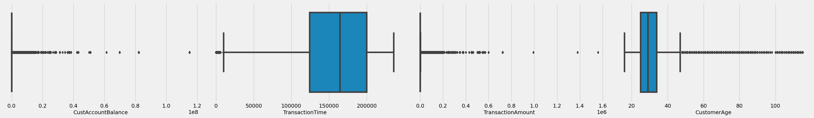
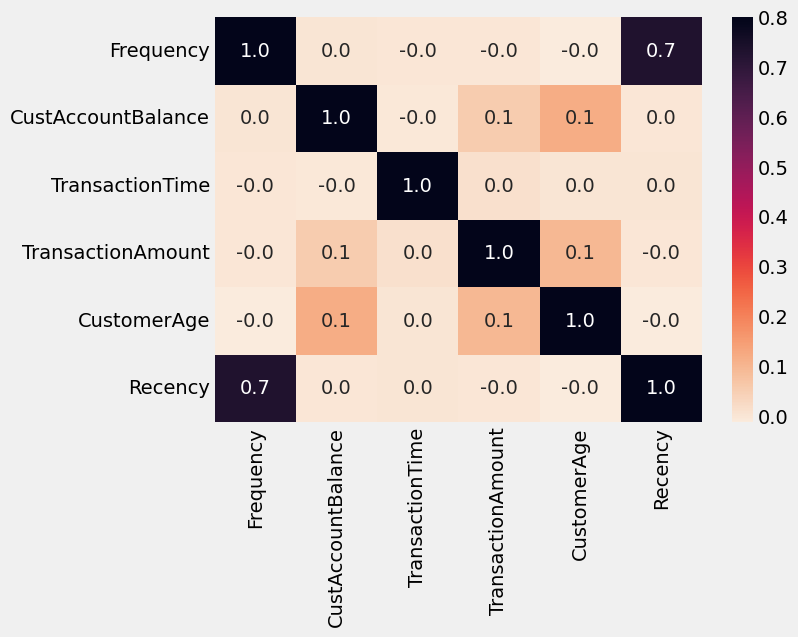
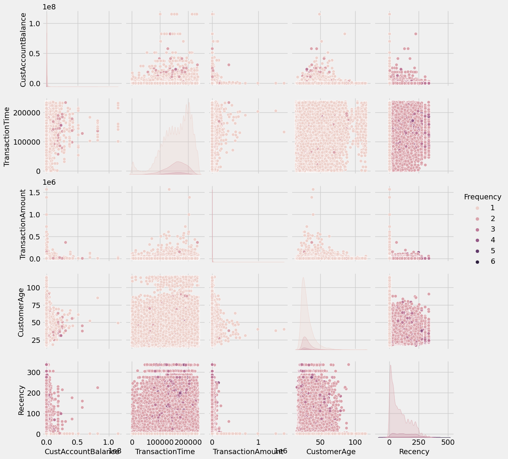
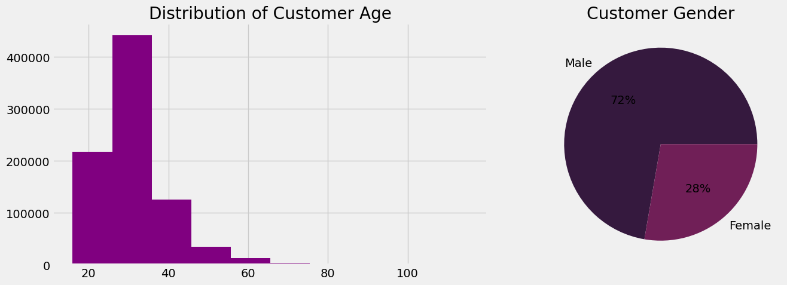
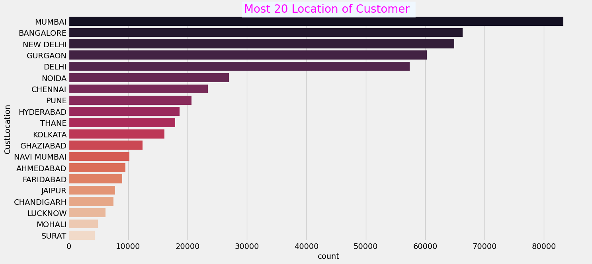
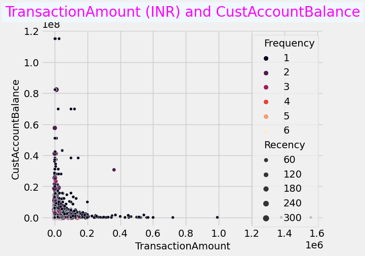
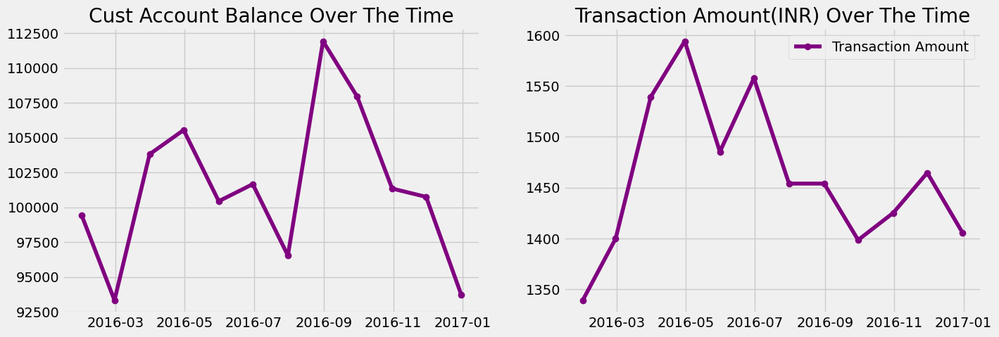

.. raw:: html

   <h2 style="color:MediumVioletRed; font-family:Cursive">

Goal of creating this Notebook🎯

.. raw:: html

   </h2>

1. Perform Clustering / Segmentation on the dataset and identify popular
   customer groups along with their definitions/rules
2. Perform Location-wise analysis to identify regional trends in India
3. Perform transaction-related analysis to identify interesting trends
   that can be used by a bank to improve / optimi their user experiences
4. Customer Recency, Frequency, Monetary analysis
5. Network analysis or Graph analysis of customer data.

**Table of contents of this notebook: 📭**

1. `Importing Necessary Libraries <#1>`__

2. `Data Collection <#2>`__

3. `Data Cleaning <#3>`__

4. `Exploratory Data Analysis <#4>`__

.. raw:: html

   <h2  style="color:darkmagenta;text-align: center; background-color: AliceBlue;padding: 20px;">

1. Importing Libraries

   .. raw:: html

      </h2>

.. code:: ipython3

    import re
    import numpy as np 
    import pandas as pd 
    import matplotlib.pyplot as plt
    %matplotlib inline
    plt.style.use("fivethirtyeight")
    import seaborn as sns

.. raw:: html

   <h2  style="color:darkmagenta;text-align: center; background-color: AliceBlue;padding: 20px;">

2. Data Collection

   .. raw:: html

      </h2>

.. code:: ipython3

    """
    Suma dos números.
    :param a: Primer número.
    :type a: int
    :param b: Segundo número.
    :type b: int
    :return: Resultado de la suma.
    :rtype: int
    """
    df = pd.read_csv("../../data/bank_transactions.csv")
    initialRows = len(df)
    df.head()

.. raw:: html

    

    
    <table border="1" class="dataframe">
      <thead>
        <tr style="text-align: right;">
          <th></th>
          <th>TransactionID</th>
          <th>CustomerID</th>
          <th>CustomerDOB</th>
          <th>CustGender</th>
          <th>CustLocation</th>
          <th>CustAccountBalance</th>
          <th>TransactionDate</th>
          <th>TransactionTime</th>
          <th>TransactionAmount (INR)</th>
        </tr>
      </thead>
      <tbody>
        <tr>
          <th>0</th>
          <td>T1</td>
          <td>C5841053</td>
          <td>10/1/94</td>
          <td>F</td>
          <td>JAMSHEDPUR</td>
          <td>17819.05</td>
          <td>2/8/16</td>
          <td>143207</td>
          <td>25.0</td>
        </tr>
        <tr>
          <th>1</th>
          <td>T2</td>
          <td>C2142763</td>
          <td>4/4/57</td>
          <td>M</td>
          <td>JHAJJAR</td>
          <td>2270.69</td>
          <td>2/8/16</td>
          <td>141858</td>
          <td>27999.0</td>
        </tr>
        <tr>
          <th>2</th>
          <td>T3</td>
          <td>C4417068</td>
          <td>26/11/96</td>
          <td>F</td>
          <td>MUMBAI</td>
          <td>17874.44</td>
          <td>2/8/16</td>
          <td>142712</td>
          <td>459.0</td>
        </tr>
        <tr>
          <th>3</th>
          <td>T4</td>
          <td>C5342380</td>
          <td>14/9/73</td>
          <td>F</td>
          <td>MUMBAI</td>
          <td>866503.21</td>
          <td>2/8/16</td>
          <td>142714</td>
          <td>2060.0</td>
        </tr>
        <tr>
          <th>4</th>
          <td>T5</td>
          <td>C9031234</td>
          <td>24/3/88</td>
          <td>F</td>
          <td>NAVI MUMBAI</td>
          <td>6714.43</td>
          <td>2/8/16</td>
          <td>181156</td>
          <td>1762.5</td>
        </tr>
      </tbody>
    </table>
    

.. code:: ipython3

    df = df.rename(columns={'TransactionAmount (INR)':'TransactionAmount'})

.. code:: ipython3

    df.shape

.. parsed-literal::

    (1048567, 9)

.. code:: ipython3

    df.info()

.. parsed-literal::

    <class 'pandas.core.frame.DataFrame'>
    RangeIndex: 1048567 entries, 0 to 1048566
    Data columns (total 9 columns):
     #   Column              Non-Null Count    Dtype  
    ---  ------              --------------    -----  
     0   TransactionID       1048567 non-null  object 
     1   CustomerID          1048567 non-null  object 
     2   CustomerDOB         1045170 non-null  object 
     3   CustGender          1047467 non-null  object 
     4   CustLocation        1048416 non-null  object 
     5   CustAccountBalance  1046198 non-null  float64
     6   TransactionDate     1048567 non-null  object 
     7   TransactionTime     1048567 non-null  int64  
     8   TransactionAmount   1048567 non-null  float64
    dtypes: float64(2), int64(1), object(6)
    memory usage: 72.0+ MB

.. raw:: html

   <h2  style="color:darkmagenta;text-align: center; background-color: AliceBlue;padding: 20px;">

3. Data Cleaning

   .. raw:: html

      </h2>

.. raw:: html

   <h4>

The amount of null data and duplicated is calculated

.. raw:: html

   </h4>

.. code:: ipython3

    def check(df):
        l=[]
        columns=df.columns
        for col in columns:
            dtypes=df[col].dtypes
            nunique=df[col].nunique()
            sum_null=df[col].isnull().sum()
            l.append([col,dtypes,nunique,sum_null])
        df_check=pd.DataFrame(l)
        df_check.columns=['column','dtypes','nunique','sum_null']
        return df_check 
    check(df)

.. raw:: html

    

    
    <table border="1" class="dataframe">
      <thead>
        <tr style="text-align: right;">
          <th></th>
          <th>column</th>
          <th>dtypes</th>
          <th>nunique</th>
          <th>sum_null</th>
        </tr>
      </thead>
      <tbody>
        <tr>
          <th>0</th>
          <td>TransactionID</td>
          <td>object</td>
          <td>1048567</td>
          <td>0</td>
        </tr>
        <tr>
          <th>1</th>
          <td>CustomerID</td>
          <td>object</td>
          <td>884265</td>
          <td>0</td>
        </tr>
        <tr>
          <th>2</th>
          <td>CustomerDOB</td>
          <td>object</td>
          <td>17254</td>
          <td>3397</td>
        </tr>
        <tr>
          <th>3</th>
          <td>CustGender</td>
          <td>object</td>
          <td>3</td>
          <td>1100</td>
        </tr>
        <tr>
          <th>4</th>
          <td>CustLocation</td>
          <td>object</td>
          <td>9355</td>
          <td>151</td>
        </tr>
        <tr>
          <th>5</th>
          <td>CustAccountBalance</td>
          <td>float64</td>
          <td>161328</td>
          <td>2369</td>
        </tr>
        <tr>
          <th>6</th>
          <td>TransactionDate</td>
          <td>object</td>
          <td>55</td>
          <td>0</td>
        </tr>
        <tr>
          <th>7</th>
          <td>TransactionTime</td>
          <td>int64</td>
          <td>81918</td>
          <td>0</td>
        </tr>
        <tr>
          <th>8</th>
          <td>TransactionAmount</td>
          <td>float64</td>
          <td>93024</td>
          <td>0</td>
        </tr>
      </tbody>
    </table>
    

.. code:: ipython3

    df.dropna(inplace=True)

.. code:: ipython3

    df.duplicated().sum()

.. parsed-literal::

    0

.. raw:: html

   <h5>

The CustomerDOB column is analyzed because it may contain atypical data.

.. raw:: html

   </h5>

.. code:: ipython3

    # Getting distinct values from CustomerDOB variable
    df['CustomerDOB'].value_counts()

.. parsed-literal::

    1/1/1800    56292
    1/1/89        809
    1/1/90        784
    6/8/91        698
    1/1/91        665
                ...  
    2/12/51         1
    20/3/52         1
    26/9/47         1
    4/10/41         1
    24/10/44        1
    Name: CustomerDOB, Length: 17233, dtype: int64

.. raw:: html

   <h5>

Dates 1/1/1800 are deleted because it is not possible to define whether
they are children, adults or persons without date of birth.

.. raw:: html

   </h5>

.. code:: ipython3

    # Removing CustomerDOB == '1/1/1800'
    df = df.loc[~(df['CustomerDOB'] == '1/1/1800')]
    # Cheking distinct values from dataframe
    df['CustomerDOB'].value_counts()

.. parsed-literal::

    1/1/89      809
    1/1/90      784
    6/8/91      698
    1/1/91      665
    1/1/92      631
               ... 
    23/2/05       1
    28/11/42      1
    23/9/49       1
    14/3/40       1
    24/10/44      1
    Name: CustomerDOB, Length: 17232, dtype: int64

.. code:: ipython3

    # Range of CustomerDOB object type as string
    print("min: " + df['CustomerDOB'].min() + " max: " + df['CustomerDOB'].max())

.. parsed-literal::

    min: 1/1/00 max: 9/9/97

.. raw:: html

   <h5>

Determine minority group of people aged over 100 years

.. raw:: html

   </h5>

.. code:: ipython3

    # We filter our dataframe specifically on the DOB column to make a decision regarding date ambiguity.
    df_filtered = df["CustomerDOB"].apply(lambda x: x if x.year < 1917 else 0)
    # Amortizing and removing values ​​greater than 1917 represented as 0
    counts = df_filtered.value_counts().drop(0)
    # Amount of customer in this age range
    print(len(counts))
    # Plot the amortized
    counts.plot()
    plt.show()

.. parsed-literal::

    254

.. image:: Customer_Segmentation_files/Customer_Segmentation_20_1.png

.. raw:: html

   <h5>

Convert type of columns TransactionDate, CustomerDOB from string to
datetime.

.. raw:: html

   </h5>

.. code:: ipython3

    # Using pandas convert to datetime tool for CustomerDOB variable with specific format
    df['CustomerDOB'] = pd.to_datetime(df['CustomerDOB'], dayfirst=True)

.. code:: ipython3

    # Checking converting problem of to_datetime pandas function
    print(df['CustomerDOB'].min(), df['CustomerDOB'].max())

.. parsed-literal::

    1973-01-01 00:00:00 2072-12-31 00:00:00

.. code:: ipython3

    # Fixing the problem base on analysis above
    df.loc[df['CustomerDOB'].dt.year > 1999, 'CustomerDOB'] -= pd.DateOffset(years=100)

.. code:: ipython3

    # Checking range of CustomerDOB variable
    print(df['CustomerDOB'].min(), df['CustomerDOB'].max())

.. parsed-literal::

    1900-01-01 00:00:00 1999-12-28 00:00:00

.. code:: ipython3

    # Using pandas convert to datetime tool for TransactionDate variable
    df['TransactionDate'] = pd.to_datetime(df['TransactionDate'])

.. code:: ipython3

    # Checking range of TransactionDate variable
    print(df['TransactionDate'].min(), df['TransactionDate'].max())

.. parsed-literal::

    2016-01-08 00:00:00 2016-12-09 00:00:00

.. raw:: html

   <h4>

Calculate customer age :

.. raw:: html

   </h4>

.. raw:: html

   <h6>

CustomerDOB is the birth date of the customer , TransactionDate : is the
date of transaction that customer is done

.. raw:: html

   </h6>

.. code:: ipython3

    # Getting the customer age at transaction moment and adding a new column in our dataframe
    df['CustomerAge'] = df['TransactionDate'].dt.year - df['CustomerDOB'].dt.year

.. code:: ipython3

    # Checking range of CustomerAge variable
    print("min: " + str(df['CustomerAge'].min()) + " max: " + str(df['CustomerAge'].max()))

.. parsed-literal::

    min: 16 max: 115

.. code:: ipython3

    # Getting distinct values from CustGender variable
    df.CustGender.value_counts()

.. parsed-literal::

    M    712454
    F    272868
    Name: CustGender, dtype: int64

.. code:: ipython3

    num_col = df.select_dtypes(include=np.number)
    cat_col = df.select_dtypes(exclude=np.number)

.. raw:: html

   <h5>

Visualize the distribution of the numeric data and detect posible
outliers. Boxplots show the median, quartiles, and extreme values ​​of
the data, and points that are above or below the extreme values ​​are
considered outliers.

.. raw:: html

   </h5>

.. code:: ipython3

    # Setting Figure specific sizes
    plt.figure(figsize=(30,30))
    # Creating boxplot 
    for index,column in enumerate(num_col):
        plt.subplot(7,4,index+1)
        sns.boxplot(data=num_col,x=column)
        
    plt.tight_layout(pad = 1.0)

.. code:: ipython3

    print("Number of initial rows: ", initialRows)
    print("Number of rows after: ", df.shape[0])
    print("Number of rows deleted: ", initialRows - df.shape[0])
    print("Percentage of rows deleted: ", (initialRows - df.shape[0]) / initialRows * 100, "%")

.. parsed-literal::

    Number of initial rows:  1048567
    Number of rows after:  985322
    Number of rows deleted:  63245
    Percentage of rows deleted:  6.03156498344884 %

.. raw:: html

   <h3 style="color:MediumVioletRed; font-family:Cursive">

Observations 💡:

.. raw:: html

   </h3>

.. raw:: html

   

We will not remove outliers for the following two reasons: First, in
boxplots those values ​​can be outliers because they represent points
that are above or below extreme values. However, these were not
measurement errors and are both true and significant, given that while
customers 100+ do not represent a key demographic for most banks.
Secoind it is important that banks are aware of the specific needs and
challenges that these clients may face, and that they adapt their
strategies accordingly.

.. raw:: html

   

.. raw:: html

   

those two articles will help you to understand this topic 📜:

.. raw:: html

   

What Are RFM Scores and How To Calculate Them Introduction to Customer
Segmentation in Python

.. raw:: html

   

Recency: number of days since the last purchase or order so we will
create a new column of TransactionDate to subtract the last transaction
from the first transaction

.. raw:: html

   

.. code:: ipython3

    df['TransactionDate1']=df['TransactionDate'] # ==> to calculate the minimum (first transaction)
    df['TransactionDate2']=df['TransactionDate'] # ==> to calculate the maximum (last transaction)

.. code:: ipython3

    #Creating MRF Table Strategy
    RFM_df = df.groupby("CustomerID").agg({
                                            "TransactionID" : "count",
                                            "CustGender" : "first",
                                            "CustLocation":"first",
                                            "CustAccountBalance"  : "mean",
                                            "TransactionTime": "mean",
                                            "TransactionAmount" : "mean",
                                            "CustomerAge" : "median",
                                            "TransactionDate2":"max",
                                            "TransactionDate1":"min",
                                            "TransactionDate":"median"
                            })
    
    RFM_df = RFM_df.reset_index()
    RFM_df.head()

.. raw:: html

    

    
    <table border="1" class="dataframe">
      <thead>
        <tr style="text-align: right;">
          <th></th>
          <th>CustomerID</th>
          <th>TransactionID</th>
          <th>CustGender</th>
          <th>CustLocation</th>
          <th>CustAccountBalance</th>
          <th>TransactionTime</th>
          <th>TransactionAmount</th>
          <th>CustomerAge</th>
          <th>TransactionDate2</th>
          <th>TransactionDate1</th>
          <th>TransactionDate</th>
        </tr>
      </thead>
      <tbody>
        <tr>
          <th>0</th>
          <td>C1010011</td>
          <td>2</td>
          <td>F</td>
          <td>NOIDA</td>
          <td>76340.635</td>
          <td>67521.0</td>
          <td>2553.0</td>
          <td>28.5</td>
          <td>2016-09-26</td>
          <td>2016-09-08</td>
          <td>2016-09-17</td>
        </tr>
        <tr>
          <th>1</th>
          <td>C1010012</td>
          <td>1</td>
          <td>M</td>
          <td>MUMBAI</td>
          <td>24204.490</td>
          <td>204409.0</td>
          <td>1499.0</td>
          <td>22.0</td>
          <td>2016-08-14</td>
          <td>2016-08-14</td>
          <td>2016-08-14</td>
        </tr>
        <tr>
          <th>2</th>
          <td>C1010014</td>
          <td>2</td>
          <td>F</td>
          <td>MUMBAI</td>
          <td>100112.950</td>
          <td>187378.0</td>
          <td>727.5</td>
          <td>28.0</td>
          <td>2016-07-08</td>
          <td>2016-01-08</td>
          <td>2016-04-08</td>
        </tr>
        <tr>
          <th>3</th>
          <td>C1010018</td>
          <td>1</td>
          <td>F</td>
          <td>CHAMPARAN</td>
          <td>496.180</td>
          <td>170254.0</td>
          <td>30.0</td>
          <td>26.0</td>
          <td>2016-09-15</td>
          <td>2016-09-15</td>
          <td>2016-09-15</td>
        </tr>
        <tr>
          <th>4</th>
          <td>C1010024</td>
          <td>1</td>
          <td>M</td>
          <td>KOLKATA</td>
          <td>87058.650</td>
          <td>141103.0</td>
          <td>5000.0</td>
          <td>51.0</td>
          <td>2016-08-18</td>
          <td>2016-08-18</td>
          <td>2016-08-18</td>
        </tr>
      </tbody>
    </table>
    

.. code:: ipython3

    # After Grouping by CustomerID
    RFM_df.shape

.. parsed-literal::

    (839081, 11)

.. code:: ipython3

    # The id of the customer is irrelevant
    RFM_df.drop(columns=["CustomerID"],inplace=True)

.. code:: ipython3

    # Renaming specific column adapting to problem goal and replacing with inplace property of function
    RFM_df.rename(columns={"TransactionID":"Frequency"},inplace=True)

.. code:: ipython3

    # Getting Recency that is by definition: number of days since the last purchase or order
    RFM_df['Recency']=RFM_df['TransactionDate2']-RFM_df['TransactionDate1']
    # Conversion from timedelta64[ns] to string representtion in days of weeks of Recency variable
    RFM_df['Recency']=RFM_df['Recency'].astype(str)

.. code:: ipython3

    # Using re library for apply an regular expresion in each value of Recency column for extract the number of days in this string representation. 
    RFM_df['Recency']=RFM_df['Recency'].apply(lambda x :re.search('\d+',x).group())
    # Conversion from string '18' to int representtion for folloeing operations
    RFM_df['Recency']=RFM_df['Recency'].astype(int)

.. raw:: html

   

Appreciation: Days mean that a customer has done transaction recently
one time by logic so I will convert 0 to 1

.. raw:: html

   

.. code:: ipython3

    # Transformation of 0 days base on business meaning
    RFM_df['Recency'] = RFM_df['Recency'].apply(lambda x: 1 if x == 0 else x)

.. code:: ipython3

    # Columns that were only needed for the calculation we eliminated
    RFM_df.drop(columns=["TransactionDate1","TransactionDate2"],inplace=True)

.. code:: ipython3

    # To calculate the otliers for each feature
    lower_list=[]
    upper_list=[]
    num_list=[]
    perc_list=[]
    cols=['Frequency', 'CustAccountBalance','TransactionAmount', 'CustomerAge', 'Recency']
    for i in cols:
        Q1 = RFM_df[i].quantile(0.25)
        Q3 = RFM_df[i].quantile(0.75)
        IQR = Q3 - Q1
        lower = Q1 - 1.5 * IQR
        upper = Q3 + 1.5 * IQR
        # Calculate number of outliers
        num=RFM_df[(RFM_df[i] < lower) | (RFM_df[i] > upper)].shape[0]
        # Calculate percentage of outliers
        perc = (num / RFM_df.shape[0]) * 100
        lower_list.append(lower)
        upper_list.append(upper)
        num_list.append(num)
        perc_list.append(round(perc,2))
    
        
    dic={'lower': lower_list, 'upper': upper_list, 'outliers': num_list, 'Perc%':perc_list }
    outliers_df=pd.DataFrame(dic,index=['Frequency', 'CustAccountBalance','TransactionAmount', 'CustomerAge', 'Recency'])
    outliers_df

.. raw:: html

    

    
    <table border="1" class="dataframe">
      <thead>
        <tr style="text-align: right;">
          <th></th>
          <th>lower</th>
          <th>upper</th>
          <th>outliers</th>
          <th>Perc%</th>
        </tr>
      </thead>
      <tbody>
        <tr>
          <th>Frequency</th>
          <td>1.000</td>
          <td>1.000</td>
          <td>128896</td>
          <td>15.36</td>
        </tr>
        <tr>
          <th>CustAccountBalance</th>
          <td>-72439.305</td>
          <td>135042.015</td>
          <td>110026</td>
          <td>13.11</td>
        </tr>
        <tr>
          <th>TransactionAmount</th>
          <td>-1313.595</td>
          <td>2669.325</td>
          <td>87229</td>
          <td>10.40</td>
        </tr>
        <tr>
          <th>CustomerAge</th>
          <td>11.500</td>
          <td>47.500</td>
          <td>42222</td>
          <td>5.03</td>
        </tr>
        <tr>
          <th>Recency</th>
          <td>1.000</td>
          <td>1.000</td>
          <td>123525</td>
          <td>14.72</td>
        </tr>
      </tbody>
    </table>
    

.. raw:: html

   

May Some variables seem like outliers but they are not, I decided spare
any data.

.. raw:: html

   

.. code:: ipython3

    RFM_df.head()

.. raw:: html

    

    
    <table border="1" class="dataframe">
      <thead>
        <tr style="text-align: right;">
          <th></th>
          <th>Frequency</th>
          <th>CustGender</th>
          <th>CustLocation</th>
          <th>CustAccountBalance</th>
          <th>TransactionTime</th>
          <th>TransactionAmount</th>
          <th>CustomerAge</th>
          <th>TransactionDate</th>
          <th>Recency</th>
        </tr>
      </thead>
      <tbody>
        <tr>
          <th>0</th>
          <td>2</td>
          <td>F</td>
          <td>NOIDA</td>
          <td>76340.635</td>
          <td>67521.0</td>
          <td>2553.0</td>
          <td>28.5</td>
          <td>2016-09-17</td>
          <td>18</td>
        </tr>
        <tr>
          <th>1</th>
          <td>1</td>
          <td>M</td>
          <td>MUMBAI</td>
          <td>24204.490</td>
          <td>204409.0</td>
          <td>1499.0</td>
          <td>22.0</td>
          <td>2016-08-14</td>
          <td>1</td>
        </tr>
        <tr>
          <th>2</th>
          <td>2</td>
          <td>F</td>
          <td>MUMBAI</td>
          <td>100112.950</td>
          <td>187378.0</td>
          <td>727.5</td>
          <td>28.0</td>
          <td>2016-04-08</td>
          <td>182</td>
        </tr>
        <tr>
          <th>3</th>
          <td>1</td>
          <td>F</td>
          <td>CHAMPARAN</td>
          <td>496.180</td>
          <td>170254.0</td>
          <td>30.0</td>
          <td>26.0</td>
          <td>2016-09-15</td>
          <td>1</td>
        </tr>
        <tr>
          <th>4</th>
          <td>1</td>
          <td>M</td>
          <td>KOLKATA</td>
          <td>87058.650</td>
          <td>141103.0</td>
          <td>5000.0</td>
          <td>51.0</td>
          <td>2016-08-18</td>
          <td>1</td>
        </tr>
      </tbody>
    </table>
    

.. raw:: html

   <h2  style="color:darkmagenta;text-align: center; background-color: AliceBlue;padding: 20px;">

4. Exploratory Data Analysis

   .. raw:: html

      </h2>

.. code:: ipython3

    RFM_df.describe()

.. raw:: html

    

    
    <table border="1" class="dataframe">
      <thead>
        <tr style="text-align: right;">
          <th></th>
          <th>Frequency</th>
          <th>CustAccountBalance</th>
          <th>TransactionTime</th>
          <th>TransactionAmount</th>
          <th>CustomerAge</th>
          <th>Recency</th>
        </tr>
      </thead>
      <tbody>
        <tr>
          <th>count</th>
          <td>839081.000000</td>
          <td>8.390810e+05</td>
          <td>839081.000000</td>
          <td>8.390810e+05</td>
          <td>839081.000000</td>
          <td>839081.000000</td>
        </tr>
        <tr>
          <th>mean</th>
          <td>1.174287</td>
          <td>1.058545e+05</td>
          <td>157446.381829</td>
          <td>1.453624e+03</td>
          <td>31.068668</td>
          <td>15.132148</td>
        </tr>
        <tr>
          <th>std</th>
          <td>0.435129</td>
          <td>7.862524e+05</td>
          <td>49194.229430</td>
          <td>6.045200e+03</td>
          <td>8.600795</td>
          <td>45.535132</td>
        </tr>
        <tr>
          <th>min</th>
          <td>1.000000</td>
          <td>0.000000e+00</td>
          <td>0.000000</td>
          <td>0.000000e+00</td>
          <td>16.000000</td>
          <td>1.000000</td>
        </tr>
        <tr>
          <th>25%</th>
          <td>1.000000</td>
          <td>5.366190e+03</td>
          <td>125604.000000</td>
          <td>1.800000e+02</td>
          <td>25.000000</td>
          <td>1.000000</td>
        </tr>
        <tr>
          <th>50%</th>
          <td>1.000000</td>
          <td>1.768220e+04</td>
          <td>163936.000000</td>
          <td>4.750000e+02</td>
          <td>29.000000</td>
          <td>1.000000</td>
        </tr>
        <tr>
          <th>75%</th>
          <td>1.000000</td>
          <td>5.723652e+04</td>
          <td>194953.000000</td>
          <td>1.175730e+03</td>
          <td>34.000000</td>
          <td>1.000000</td>
        </tr>
        <tr>
          <th>max</th>
          <td>6.000000</td>
          <td>1.150355e+08</td>
          <td>235959.000000</td>
          <td>1.560035e+06</td>
          <td>115.000000</td>
          <td>336.000000</td>
        </tr>
      </tbody>
    </table>
    

.. code:: ipython3

    # correlation between features
    plt.figure(figsize=(7,5))
    correlation=RFM_df.corr()
    sns.heatmap(correlation,vmin=None,
        vmax=0.8,
        cmap='rocket_r',
        annot=True,
        fmt='.1f',
        linecolor='white',
        cbar=True);

.. parsed-literal::

    /tmp/ipykernel_1886261/3937467450.py:3: FutureWarning: The default value of numeric_only in DataFrame.corr is deprecated. In a future version, it will default to False. Select only valid columns or specify the value of numeric_only to silence this warning.
      correlation=RFM_df.corr()

.. code:: ipython3

    plt.style.use("fivethirtyeight")
    sns.pairplot(RFM_df,hue='Frequency');

.. code:: ipython3

    plt.style.use("fivethirtyeight")
    chart=sns.countplot(x='Frequency',data=RFM_df,palette='rocket', order = RFM_df['Frequency'].value_counts().index)
    plt.title("Frequency",
              fontsize='20',
              backgroundcolor='AliceBlue',
              color='magenta');

.. image:: Customer_Segmentation_files/Customer_Segmentation_56_0.png

.. code:: ipython3

    plt.style.use("fivethirtyeight")
    fig,ax=plt.subplots(ncols=2,nrows=1,figsize=(15,5))
    palette_color = sns.color_palette('rocket')
    ax[0].hist(x=RFM_df['CustomerAge'],color='purple')
    ax[0].set_title("Distribution of Customer Age")
    ax[1].pie(RFM_df['CustGender'].value_counts(),autopct='%1.f%%',colors=palette_color,labels=['Male','Female'])
    ax[1].set_title("Customer Gender")
    plt.tight_layout();

.. code:: ipython3

    plt.style.use("fivethirtyeight")
    plt.figure(figsize=(15,7))
    chart=sns.countplot(y='CustLocation',data=RFM_df,palette='rocket', order = RFM_df['CustLocation'].value_counts()[:20].index)
    plt.title("Most 20 Location of Customer ",
              fontsize='20',
              backgroundcolor='AliceBlue',
              color='magenta');

.. code:: ipython3

    plt.style.use("fivethirtyeight")
    sns.scatterplot(x='TransactionAmount',y='CustAccountBalance',data=RFM_df,palette='rocket',hue='Frequency',size='Recency' )
    plt.title("TransactionAmount (INR) and CustAccountBalance",
              fontsize='20',
              backgroundcolor='AliceBlue',
              color='magenta');

.. parsed-literal::

    /home/alejandro/.local/lib/python3.8/site-packages/IPython/core/events.py:89: UserWarning: Creating legend with loc="best" can be slow with large amounts of data.
      func(*args, **kwargs)
    /home/alejandro/.local/lib/python3.8/site-packages/IPython/core/pylabtools.py:152: UserWarning: Creating legend with loc="best" can be slow with large amounts of data.
      fig.canvas.print_figure(bytes_io, **kw)

.. code:: ipython3

    # difference between maximum and minimum date
    RFM_df['TransactionDate'].max()-RFM_df['TransactionDate'].min()

.. parsed-literal::

    Timedelta('336 days 00:00:00')

.. code:: ipython3

    RFM_df=RFM_df.sort_values(by='TransactionDate')
    groupbby_month=RFM_df.groupby([pd.Grouper(key='TransactionDate',freq='M')]).mean()
    print(groupbby_month.shape)
    groupbby_month

.. parsed-literal::

    (12, 6)

.. parsed-literal::

    /tmp/ipykernel_1886261/347716159.py:2: FutureWarning: The default value of numeric_only in DataFrameGroupBy.mean is deprecated. In a future version, numeric_only will default to False. Either specify numeric_only or select only columns which should be valid for the function.
      groupbby_month=RFM_df.groupby([pd.Grouper(key='TransactionDate',freq='M')]).mean()

.. raw:: html

    

    
    <table border="1" class="dataframe">
      <thead>
        <tr style="text-align: right;">
          <th></th>
          <th>Frequency</th>
          <th>CustAccountBalance</th>
          <th>TransactionTime</th>
          <th>TransactionAmount</th>
          <th>CustomerAge</th>
          <th>Recency</th>
        </tr>
        <tr>
          <th>TransactionDate</th>
          <th></th>
          <th></th>
          <th></th>
          <th></th>
          <th></th>
          <th></th>
        </tr>
      </thead>
      <tbody>
        <tr>
          <th>2016-01-31</th>
          <td>1.023535</td>
          <td>99430.235124</td>
          <td>157265.789770</td>
          <td>1339.251024</td>
          <td>30.834616</td>
          <td>1.812399</td>
        </tr>
        <tr>
          <th>2016-02-29</th>
          <td>1.060922</td>
          <td>93326.181885</td>
          <td>158205.582772</td>
          <td>1399.785006</td>
          <td>30.849497</td>
          <td>4.899824</td>
        </tr>
        <tr>
          <th>2016-03-31</th>
          <td>1.086487</td>
          <td>103808.517021</td>
          <td>158177.329631</td>
          <td>1539.192142</td>
          <td>31.066789</td>
          <td>8.173665</td>
        </tr>
        <tr>
          <th>2016-04-30</th>
          <td>1.163838</td>
          <td>105543.379683</td>
          <td>157837.754316</td>
          <td>1593.985274</td>
          <td>31.051824</td>
          <td>23.924108</td>
        </tr>
        <tr>
          <th>2016-05-31</th>
          <td>1.341184</td>
          <td>100434.957463</td>
          <td>157353.966707</td>
          <td>1485.286222</td>
          <td>30.856852</td>
          <td>60.218238</td>
        </tr>
        <tr>
          <th>2016-06-30</th>
          <td>1.344024</td>
          <td>101659.608711</td>
          <td>157673.525936</td>
          <td>1557.533949</td>
          <td>30.887388</td>
          <td>51.326862</td>
        </tr>
        <tr>
          <th>2016-07-31</th>
          <td>1.341087</td>
          <td>96535.576484</td>
          <td>157185.137192</td>
          <td>1453.967449</td>
          <td>30.926613</td>
          <td>35.571659</td>
        </tr>
        <tr>
          <th>2016-08-31</th>
          <td>1.147972</td>
          <td>111922.967559</td>
          <td>156982.533508</td>
          <td>1453.964534</td>
          <td>31.239593</td>
          <td>7.009712</td>
        </tr>
        <tr>
          <th>2016-09-30</th>
          <td>1.201000</td>
          <td>107963.818667</td>
          <td>157945.037096</td>
          <td>1398.478069</td>
          <td>31.038822</td>
          <td>10.089098</td>
        </tr>
        <tr>
          <th>2016-10-31</th>
          <td>1.228312</td>
          <td>101343.472476</td>
          <td>158561.823716</td>
          <td>1425.168714</td>
          <td>30.905476</td>
          <td>18.680699</td>
        </tr>
        <tr>
          <th>2016-11-30</th>
          <td>1.055598</td>
          <td>100745.295199</td>
          <td>157783.769600</td>
          <td>1464.565195</td>
          <td>31.013708</td>
          <td>3.674762</td>
        </tr>
        <tr>
          <th>2016-12-31</th>
          <td>1.011268</td>
          <td>93716.370712</td>
          <td>156572.791719</td>
          <td>1405.804742</td>
          <td>30.918373</td>
          <td>1.382713</td>
        </tr>
      </tbody>
    </table>
    

.. code:: ipython3

    plt.style.use("fivethirtyeight")
    fig,ax=plt.subplots(ncols=2,nrows=1,figsize=(15,5))
    ax[0].plot(groupbby_month.index,groupbby_month['CustAccountBalance'],color='purple',marker='o',label='Customer Account Balance')
    ax[0].set_title('Cust Account Balance Over The Time')
    ax[1].plot(groupbby_month.index,groupbby_month['TransactionAmount'],color='purple',marker='o',label='Transaction Amount')
    ax[1].set_title("Transaction Amount Over The Time")
    plt.legend();

